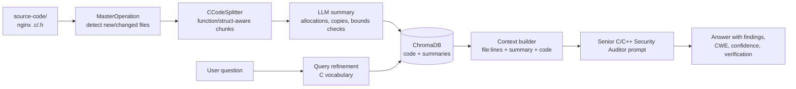

# Security-Focused Local RAG Assistant for C/C++ Code

A local, private Retrieval-Augmented Generation (RAG) assistant for **auditing C/C++ code for memory-corruption vulnerabilities**. It is set up for the **Nginx** code base.

The assistant indexes a C code tree into a local vector database. You then ask it questions in plain English, such as *"Where is this heap buffer sized, and is every write into it bounds-checked?"* It finds the relevant functions, structs and summaries, and answers as a **Senior C/C++ Security Auditor**. Its answers focus on memory safety, buffer bounds checking, pointer arithmetic and integer issues, and cite file and line ranges.

Everything runs on your machine:

| Component | Role |
|---|---|
| **[Ollama](https://ollama.com/)** | Runs the local LLM (answers, summaries, query rewriting) and the embedding model |
| **[LangChain.js](https://js.langchain.com/)** | Prompt templates, text splitting, the retrieval pipeline |
| **[ChromaDB](https://www.trychroma.com/)** | Local vector store for code chunks and their security-oriented summaries |
| **MySQL** | Tracks ingestion state, so scans can resume and only changed files are processed again |
| **Node.js / TypeScript / Express** | API server and ingestion pipeline |

No source code or questions leave your machine.

> **Research tool, not an oracle.** The assistant finds *leads*: code paths worth a closer look. Every finding must be checked by hand, and confirmed with tools such as AddressSanitizer, fuzzing, or a proof-of-concept against a test build. Report any new vulnerability you find through responsible disclosure (for Nginx, see the [nginx security advisories page](https://nginx.org/en/security_advisories.html)).

---

## Motivation: CVE-2026-42945

This project supports Master's thesis research on memory-corruption bugs in large C code bases. The case study is **CVE-2026-42945**, a critical heap buffer overflow in Nginx's `ngx_http_rewrite_module`, publicly disclosed in May 2026:

- **Affected**: NGINX Open Source 1.0.0 to 1.30.0. **Fixed** in 1.30.1 and 1.31.0.
- **Trigger conditions (per public advisories)**: a `rewrite` directive that uses unnamed PCRE captures (`$1`, `$2`, …) with a replacement string that contains a question mark (`?`). A crafted request can then overflow a heap buffer in the worker process.
- **Impact**: reliable worker crashes (DoS). Remote code execution is considered possible but hard.

Bugs like this one are hard to find with `grep`. The overflow is not in one line. It sits between two functions: one computes a buffer length, and a different one writes into the buffer. This assistant is built for that kind of question. Its chunker keeps each function whole and keeps Nginx's `*_len_code` / `*_code` pairs together, and its prompt tells the LLM to check that the length pass and the copy pass agree.

A good exercise is to index **both** the vulnerable release (`release-1.30.0`) and the patched one (`release-1.30.1`) in separate collections, then ask the same questions of each.

References: [F5 advisory K000161019](https://my.f5.com/manage/s/article/K000161019) · [Akamai analysis](https://www.akamai.com/blog/security-research/nginx-critical-heap-buffer-overflow-cve-2026-42945) · [Orca Security](https://orca.security/resources/blog/nginx-rewrite-module-vulnerability-cve-2026-42945/) · [Red Hat](https://access.redhat.com/security/cve/cve-2026-42945)

---

## How It Works



1. **Scanning**: every `.c` / `.h` file under `source-code/` is hashed. Only new or modified files are queued.
2. **C/C++-aware chunking** (`src/app/libs/splitters/CCodeSplitter.ts`): see [below](#cc-aware-chunking).
3. **Security-oriented summarization**: each chunk is summarized with attention to allocations, size arithmetic, copies, bounds checks and attacker-controlled inputs. This means a search like *"buffer sized from regex captures"* finds the right code even when those words do not appear in it.
4. **Storage**: chunks and summaries are embedded and stored in ChromaDB, with metadata (file, line range, function names).
5. **Retrieval and answering**: the question is (optionally) rewritten into C/Nginx vocabulary. The closest chunks and summaries are retrieved and labelled with `file (lines X-Y) | functions`. The auditor prompt produces a structured answer.

### C/C++-Aware Chunking

LangChain's `RecursiveCharacterTextSplitter.fromLanguage('cpp')` splits on keywords such as `\nvoid ` or `\nint `. That fails on Nginx's style, which puts the return type on its own line:

```c
static ngx_int_t
ngx_http_do_read_client_request_body(ngx_http_request_t *r)
{
```

The generic splitter cuts functions apart at arbitrary points. A buffer allocation and the `memcpy` that overflows it can end up in different chunks. `CCodeSplitter` replaces it for `.c`, `.h`, `.cc`, `.cpp`, `.cxx`, `.hpp`, `.hh` and `.hxx`:

- **Lexer-based boundary detection.** It tracks brace depth and ignores braces inside comments, string/char literals and preprocessor lines. Boundaries fall only at the end of top-level declarations: function bodies, `struct`/`union`/`enum`/`typedef` blocks, prototypes, globals and `#define`s. A `}` in column 0 resyncs the depth counter, so `#if`/`#else` branches with unbalanced braces cannot break later chunks.
- **Whole-unit packing.** Each declaration, together with the comment block above it, is atomic. Units are packed greedily up to `CHUNK_SIZE_C` characters. **A function or struct that fits is never split.**
- **Length/copy pair affinity.** Nginx computes buffer sizes in `*_len_code` functions and fills buffers in the matching `*_code` functions (for example `ngx_http_script_copy_capture_len_code` / `ngx_http_script_copy_capture_code`). These pairs are merged into one chunk whenever they fit, so the LLM sees both halves of the size contract.
- **Graceful fallback for huge functions.** A function larger than the chunk size is split at statement boundaries (blank lines, `if (`, `for (`, `case`, `;\n`). Each continuation chunk starts with `/* [continued] <function signature> */`.
- **Rich metadata.** `fromLine`, `toLine` and `symbols` (function and type names) are stored with every chunk and used in the prompt context, so answers can cite `file:lines`.

On the full Nginx `src/` tree (411 files), all non-blank lines are covered and no chunk is larger than the configured size.

### The Auditor Prompt

The final answer prompt (`PROMPT_USER_QUERY_AND_DATA_CONTEXT` in `src/app/settings.ts`) tells the model to act as a **Senior C/C++ Security Auditor**. It ranks priorities in this order: memory safety → buffer bounds → pointer arithmetic → integer issues → two-pass length/copy consistency → attacker control. It also requires the model to:

- cite file, line range and function for every claim;
- separate **Confirmed** from **Potential** findings, and state the invariant when code looks safe;
- avoid inventing code, CVE numbers or patch details that are not in the retrieved context;
- answer in a fixed format: **Summary → Findings (severity, location, CWE, evidence, reasoning, confidence) → Verification steps**.

The summarization and query-rewriting prompts in the same file are tuned for C security vocabulary too.

---

## Quickstart

### 1. Prerequisites

- **Node.js** 22 or later
- **Docker** (for ChromaDB and MySQL)
- **Ollama**, with the chat and embedding models you choose already pulled. A code-capable model with at least 7B parameters gives much better audit answers than the small default, for example:

  ```sh
  ollama pull qwen2.5-coder:7b
  ollama pull snowflake-arctic-embed2:568m
  ```

### 2. Install

```sh
git clone https://github.com/swapnil8222/security-rag-assistant.git
cd security-rag-assistant
npm install --legacy-peer-deps
cp .env.example .env
```

Edit `.env` to set your models (see [Configuration](#configuration)).

### 3. Add the Nginx Source

```sh
git clone https://github.com/nginx/nginx.git source-code/nginx
cd source-code/nginx
git checkout release-1.30.0   # vulnerable to CVE-2026-42945; use release-1.30.1 for the patched code
cd ../..
```

### 4. Start the Services

```sh
cd docker && docker compose up -d && cd ..
npm run dev        # API on http://localhost:5000
```

### 5. Index the Code Base

In a second terminal:

```sh
npm run load-docs
```

The first run summarizes every chunk with the LLM, so it can take a long time on the full Nginx tree. You can stop it at any point and run the command again to resume. For faster experiments, copy only a subtree (for example `src/http/`) into `source-code/`.

### 6. Ask Questions

```sh
curl -s http://localhost:5000/api/agent/rag \
  -H 'Content-Type: application/json' \
  -d '{
        "query": "Is every write into the rewrite result buffer bounds-checked?",
        "refineUserPrompt": true,
        "similaritySearchResults": 6
      }'
```

---

## Configuration

| Variable | Default | Purpose |
|---|---|---|
| `LLM_MODEL` | `qwen3:1.7b` | Chat model for summaries and answers (a 7B+ coder model is recommended) |
| `LLM_MODEL_REFINE_QUERY` | `qwen3:1.7b` | Model that rewrites questions into search queries |
| `LLM_EMBEDDING_MODEL` | `snowflake-arctic-embed2:568m` | Embedding model |
| `LLM_NUM_CTX` | `8192` | Ollama context window. Must fit several C chunks plus their summaries |
| `LLM_TEMPERATURE` | `0.1` | Low temperature for precise, repeatable audit answers |
| `VECTOR_DB_COLLECTION_NAME` | `nginx-audit` | Use one collection per code version (e.g. `nginx-1.30.0`, `nginx-1.30.1`) |
| `SCAN_EXTENSIONS` | `c,h` | File extensions to index under `source-code/` |
| `CHUNK_SIZE_C` | `3000` | Maximum characters per C/C++ chunk |
| `CHUNK_OVERLAP_C` | `200` | Overlap, used only when a single function exceeds `CHUNK_SIZE_C` |

---

## API Reference

| Method | Endpoint | Description |
|---|---|---|
| `POST` | `/api/agent/rag` | Ask the auditor about the indexed code. Body: `query`, optional `refineUserPrompt` (bool), `similaritySearchResults` (int), `model` |
| `POST` | `/api/agent/ask` | Ask the LLM directly, without RAG |
| `POST` | `/api/agent/ask-stream` | Same as above, streamed as server-sent events |
| `POST` | `/api/operations/run-master` | Scan `source-code/` and queue new or changed files |
| `POST` | `/api/operations/run-rand` | Process one queued operation (chunk, summarize or embed) |
| `POST` | `/api/operations/reset` | **Delete** all vector-store and database data |
| `GET` | `/api/tools/ollama/models` | List installed Ollama models |
| `GET` | `/api/tools/vector-store/get-latest-entries` | Show the 50 most recent vector-store entries |
| `GET` | `/api/test` | Health check |

The `rag` response contains `finalAnswer`, and also `refinedUserQuery`, `searchResult` and `contextData`. Log these alongside the answer so your thesis experiments can be reproduced.

---

## Example Session (Illustrative)

> The transcript below is an **illustrative mock interaction**. It shows the kind of output the assistant is designed to produce when `source-code/` contains Nginx `release-1.30.0`. Real output depends on the model, retrieval results and settings. Code excerpts are shortened for readability, and line numbers refer to the `release-1.30.0` files.

### Turn 1: Request Body Buffering

**User**

```json
{ "query": "How does nginx buffer the client request body in memory? Can a large or chunked body write past the end of rb->buf?", "refineUserPrompt": true }
```

**Refined search query:** `Reading the client request body into rb->buf: buffer allocation, size computation, recv into buffer, rb->rest, request body filters.`

**Retrieved context** (headers only)

```
### [1] src/http/ngx_http_request_body.c (lines 294-384) | ngx_http_do_read_client_request_body
### [2] src/http/ngx_http_request_body.c (lines 31-140) | ngx_http_read_client_request_body
### [3] src/http/ngx_http_request.h (lines 260-344) | ngx_http_request_body_t, ...
### [4] src/http/ngx_http_request_body.c (lines 1087-1168) | ngx_http_request_body_chunked_filter
```

**Assistant**

**Summary**
The body is read into `rb->buf`, a buffer of `client_body_buffer_size` bytes that is allocated once per request. When it fills up, it is flushed through the request body filters (to a temp file, or passed upstream when unbuffered) and then reused. In the retrieved code, every `recv()` into `rb->buf` is limited by the space left in the buffer, so I see **no overflow path in request body buffering**.

**Findings**

1. **Informational: the read is correctly bounded**
   - *Location:* `ngx_http_request_body.c:366-377`, `ngx_http_do_read_client_request_body`
   - *Evidence:*
     ```c
     size = rb->buf->end - rb->buf->last;
     rest = rb->rest - (rb->buf->last - rb->buf->pos);
     if ((off_t) size > rest) {
         size = (size_t) rest;
     }
     n = c->recv(c, rb->buf->last, size);
     ```
   - *Reasoning:* `size` is capped by the free space (`end - last`) and then by the bytes still expected (`rest`). The `(size_t) rest` cast runs only when `rest < size`, so it cannot truncate. The code stays safe as long as `rb->buf->last <= rb->buf->end`; the retrieved code keeps this true by resetting `last` to `start` after each flush.
   - *Confidence:* Confirmed safe (for the code shown).

2. **Informational: the chunked parser needs a separate review**
   - *Location:* `ngx_http_request_body.c:1087-1168`, `ngx_http_request_body_chunked_filter`
   - *Reasoning:* Chunk sizes come from the client (hex digits in the chunked encoding). The filter only builds buffer descriptors that point into existing memory; it does not copy. Its safety depends on `ngx_http_parse_chunked()`, which is **not in the retrieved context**. Retrieve `src/http/ngx_http_parse.c` to check overflow handling of `ctx->size`.
   - *Confidence:* Potential (context incomplete).

**Verification steps**
Build with `--with-cc-opt='-fsanitize=address'`. Send bodies of `client_body_buffer_size ± 1` bytes, and chunked bodies with very large hex chunk sizes. Fuzz `ngx_http_parse_chunked` with libFuzzer.

### Turn 2: Where a Request-Derived Buffer Is Sized in One Pass and Filled in Another

**User**

```json
{ "query": "While nginx processes the request URI, where does it allocate a heap buffer using one length calculation and then fill it in a separate step? I'm looking at rewrite rules with $1 and a '?' in the replacement (CVE-2026-42945). Could the copy exceed the allocation?", "refineUserPrompt": true }
```

**Refined search query:** `Rewrite script engine: length codes computing buffer size, ngx_pnalloc allocation, copy codes writing regex captures, is_args, ngx_escape_uri NGX_ESCAPE_ARGS.`

**Retrieved context** (headers only)

```
### [1] src/http/ngx_http_script.c (lines 1037-1144) | ngx_http_script_regex_start_code
### [2] src/http/ngx_http_script.c (lines 1297-1409) | ngx_http_script_add_capture_code, ngx_http_script_copy_capture_len_code, ngx_http_script_copy_capture_code
### [3] src/http/ngx_http_script.c (lines 1138-1191) | ngx_http_script_regex_start_code
### [4] src/http/ngx_http_script.c (lines 931-1035) | ngx_http_script_copy_var_code, ngx_http_script_add_args_code, ngx_http_script_mark_args_code, ngx_http_script_start_args_code
```

**Assistant**

**Summary**
Yes, this is a **two-pass length/copy pattern**, and the passes can disagree. `ngx_http_script_regex_start_code` sizes the result buffer `e->buf` by running the *length* codes on a separate, zeroed engine `le`. The *copy* codes then write into `e->buf` using the main engine `e`. Whether a capture is URI-escaped (which can triple its size) depends on `is_args`, and `is_args` is tracked separately in `le` and `e`. `ngx_http_script_copy_capture_code` does not check `e->pos` against the end of the buffer. If `e->is_args` is 1 when the length pass assumed 0, the copy writes past the allocation. That would be a **heap buffer overflow**.

**Findings**

1. **High: the length and copy passes use different `is_args` state; the copy has no bounds check**
   - *Location:* `ngx_http_script.c:1138-1191` (`ngx_http_script_regex_start_code`), `1297-1409` (`ngx_http_script_copy_capture_len_code` / `ngx_http_script_copy_capture_code`)
   - *Class:* CWE-122 Heap-based Buffer Overflow (root cause: CWE-131 Incorrect Calculation of Buffer Size)
   - *Evidence (length pass, fresh engine):*
     ```c
     ngx_memzero(&le, sizeof(ngx_http_script_engine_t));   /* le.is_args == 0 */
     ...
     while (*(uintptr_t *) le.ip) {
         lcode = *(ngx_http_script_len_code_pt *) le.ip;
         len += lcode(&le);
     }
     e->buf.len = len;
     ...
     e->buf.data = ngx_pnalloc(r->pool, e->buf.len);
     e->quote = code->redirect;       /* e->quote is reset ...          */
     e->pos = e->buf.data;            /* ... but e->is_args is not      */
     ```
     *Copy pass, main engine:*
     ```c
     if ((e->is_args || e->quote)
         && (e->request->quoted_uri || e->request->plus_in_uri))
     {
         e->pos = (u_char *) ngx_escape_uri(pos, &p[cap[n]],
                                            cap[n + 1] - cap[n],
                                            NGX_ESCAPE_ARGS);
     } else {
         e->pos = ngx_copy(pos, &p[cap[n]], cap[n + 1] - cap[n]);
     }
     ```
   - *Reasoning:* `ngx_http_script_mark_args_code` / `start_args_code` (lines 1014-1031) set `is_args = 1` when the replacement reaches its `?`. In the length pass this happens on `le`, which starts at 0 for each regex. In the copy pass it happens on `e`, and `regex_start_code` never clears `e->is_args`. So `e->is_args` can still be 1 from an earlier step, and a capture written *before* the `?` is then escaped during the copy although the length pass counted it unescaped. `NGX_ESCAPE_ARGS` expands each escaped byte to 3 bytes (`%XX`). An attacker who controls the URI (the capture source) can fill the capture with characters that need escaping, such as a long run of `+` (which sets `plus_in_uri`). The overflow size is then about 2 × (number of escaped bytes), and the attacker chooses the bytes. The destination is a pool allocation (`ngx_pnalloc`), so nearby pool data can be corrupted.
   - *Preconditions:* a `rewrite` with an unnamed capture (`$1`…) and a `?` in the replacement, as you described. Whether `e->is_args` can actually be 1 when `regex_start_code` runs depends on the order of script codes produced for the configuration. That code (`ngx_http_rewrite_module.c`, `ngx_http_script_regex_compile`) is **not in the retrieved context**.
   - *Confidence:* Potential. The unchecked copy is confirmed; reachability of the stale state needs the rewrite-module code or a dynamic test.

2. **Medium: the `lengths == NULL` fast path estimates escaping over the whole URI, not per capture**
   - *Location:* `ngx_http_script.c:1143-1155`
   - *Evidence:* `e->buf.len += 2 * ngx_escape_uri(NULL, r->uri.data, r->uri.len, NGX_ESCAPE_ARGS);`
   - *Reasoning:* The estimate is taken from `r->uri`, but the copy escapes `r->captures_data` segments. If the captures do not come from `r->uri`, or the same capture is used more than once, the estimate may be too small. This needs the compile-time conditions that set `lengths = NULL`.
   - *Confidence:* Potential.

**Verification steps**
1. Build `release-1.30.0` with AddressSanitizer: `./auto/configure --with-cc-opt='-fsanitize=address -g' --with-ld-opt='-fsanitize=address'`.
2. Use a test configuration with an unnamed capture and a `?` in the replacement, e.g. `rewrite ^/api/(.*)$ /internal?id=$1;`, together with other rewrite steps that change `is_args` before it.
3. Send requests whose captured part has long runs of characters that need escaping (e.g. `+`). Watch for `heap-buffer-overflow` reports in `ngx_escape_uri`.
4. Diff `src/http/ngx_http_script.c` between `release-1.30.0` and `release-1.30.1` to see how upstream closed this path.

> **Auditor's note (added for this README):** Diffing `ngx_http_script.c` between `release-1.30.0` and `release-1.30.1` shows that the upstream fix adds a new `ngx_http_script_check_length()` bounds check (against a new `e->end` pointer) before every copy. It also explicitly resets `e->is_args = 0` in `ngx_http_script_regex_start_code` and `ngx_http_script_regex_end_code`, and moves the escape estimate to a per-capture calculation. These are the same weak points the mock answer highlights. Treat this as a check that the approach is sound, not as a full root-cause analysis. The official advisory and the patch remain the authoritative sources.

---

## Limitations

- **Retrieval is only as good as the chunks retrieved.** Bugs that span many files (callers, macros, config parsing) may need several questions, or a higher `similaritySearchResults`.
- **Small models make things up.** Use a 7B+ code model, keep the temperature low, and always check the cited lines.
- **Lexical, not semantic, parsing.** `CCodeSplitter` is a heuristic lexer, not a compiler front end. Heavy macro metaprogramming or K&R-style declarations may produce less clean boundaries. It will still cover every line.
- **No data flow or taint analysis.** Use this tool alongside static analyzers (CodeQL, Coccinelle, clang-analyzer) and fuzzers. It does not replace them.

## Project Structure (Key Files)

```
src/app/settings.ts                             # Prompts (auditor, summarizer, query refiner) and extension→language map
src/app/libs/splitters/CCodeSplitter.ts         # C/C++ structure-aware chunker
src/app/libs/operations/ChunkContentOperation.ts# Picks the C splitter for .c/.h/.cpp/.hpp…
src/app/libs/operations/SummarizeContentOperation.ts
src/app/libs/llm/AiAgent.ts                     # RAG pipeline and context builder (file:lines headers)
src/scripts/scan-docs.ts                        # `npm run load-docs` ingestion entry point
```

## Acknowledgements and License

This project is a fork of [danielefavi/ai-codebase-assistant](https://github.com/danielefavi/ai-codebase-assistant), adapted here for C/C++ security auditing. It is distributed under the **GNU General Public License v3.0**, like the original. See [LICENSE](LICENSE).

Nginx is a trademark of F5, Inc. This project is not affiliated with or endorsed by F5 or the Nginx project.
